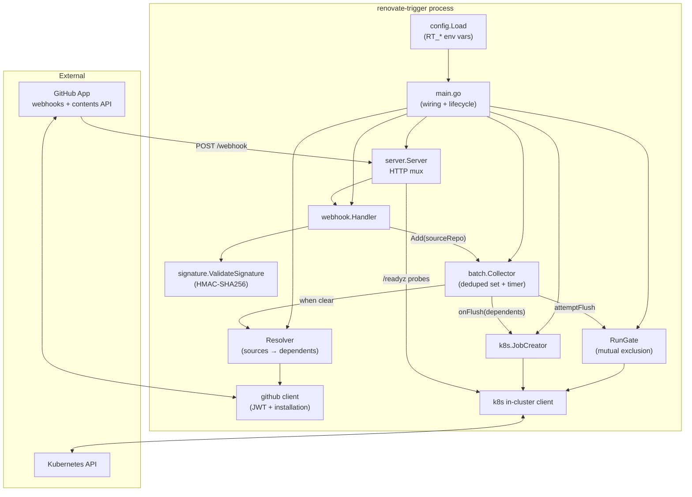
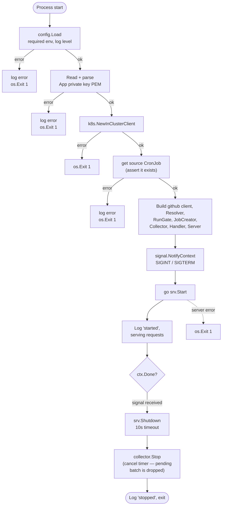
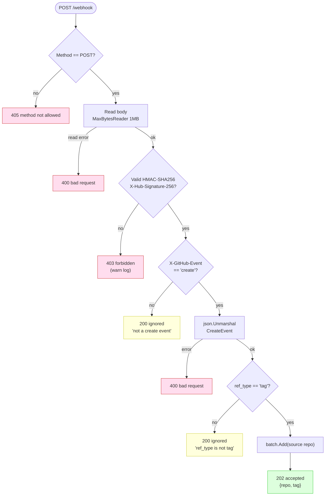
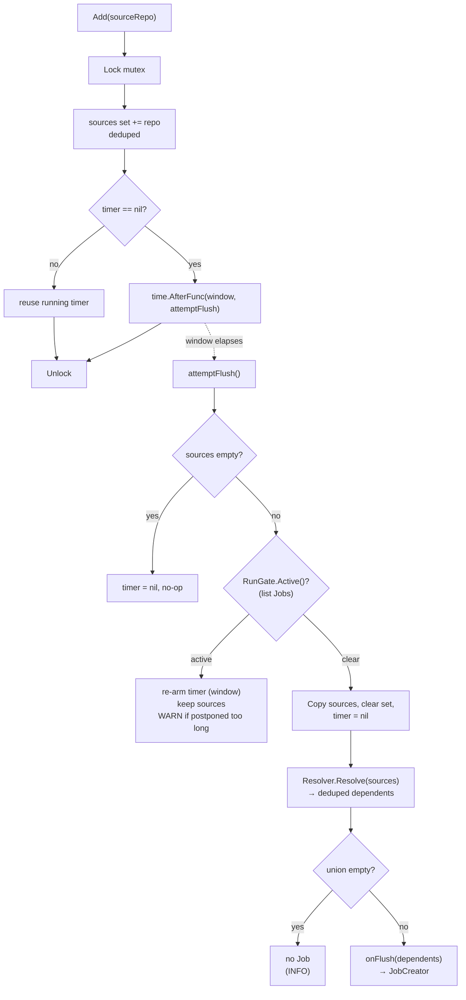
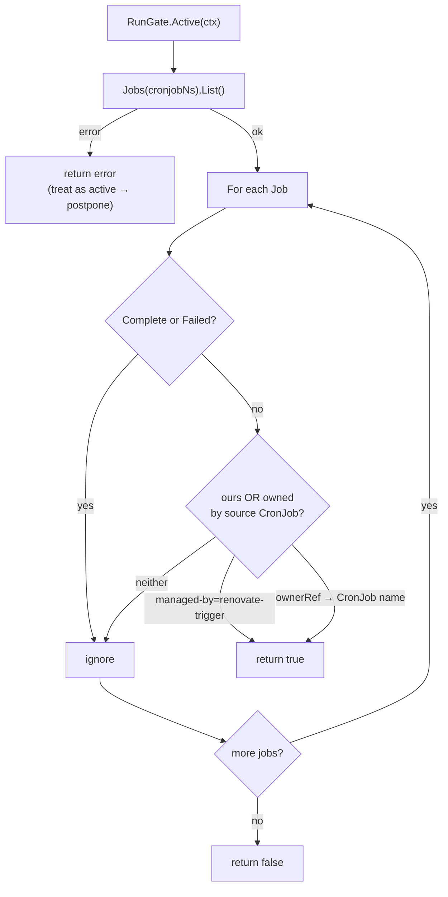
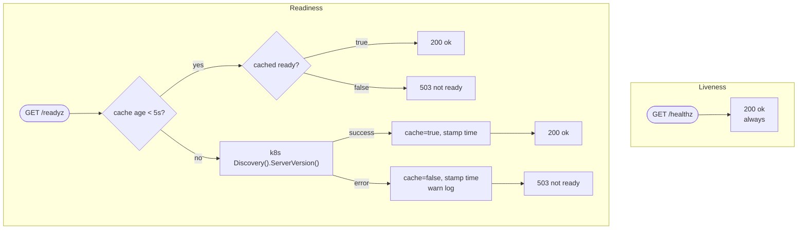
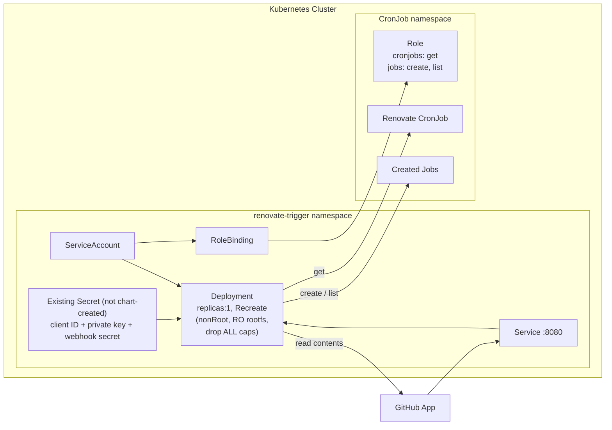

# Renovate-Trigger — Workflow Diagrams

`renovate-trigger` reacts to GitHub tag events and runs Renovate on the repos
that **consume** the tagged code. A tag on a **dependency** repo is batched over a
short window; at flush it reads each dependency's `renovate.trigger.json` (on the
default branch) to resolve its **dependents**, then — if no Renovate run is
already active — creates a one-off `Job` cloned from an existing Renovate
`CronJob`, injecting the dependents via `RENOVATE_REPOSITORIES`.

A single **GitHub App** both delivers the webhooks and grants read access to the
trigger files. See `CONTEXT.md` for vocabulary and `docs/adr/` for the decisions.

> Diagrams reflect the intended design: decentralized opt-in via
> `renovate.trigger.json`, GitHub-App auth (client-ID JWT, per-repo installation
> discovery), flush-time resolution, and best-effort mutual exclusion.

---

## 1. Component Architecture

How the packages wire together, from `main.go` down to the external APIs.



---

## 2. Startup & Graceful Shutdown

Lifecycle managed in `cmd/renovate-trigger/main.go`. Startup fails loud on any
config error; it does **not** mint a GitHub token at boot.



---

## 3. Webhook Request Handling

`internal/webhook/handler.go` — validation and event-filtering gauntlet. No
GitHub calls happen here; an accepted event just adds the **source** repo to the
batch. Opt-out (no trigger file) is discovered later, at flush.



> The opt-in gate (App installed + trigger file present) is not enforced here —
> a source repo with no `renovate.trigger.json` is accepted, then contributes
> nothing at resolution time (logged DEBUG).

---

## 4. Batch Collection, Gate & Flush

`internal/batch/collector.go` — a fixed tumbling window over **source** repos.
On fire, the flush is gated by mutual exclusion; if a Renovate run is active it
postpones and keeps accumulating.



---

## 5. Mutual Exclusion (RunGate)

Whether a Renovate run is already active. Best-effort — the CronJob is not
suspended, so a small TOCTOU window against the CronJob controller is accepted.



---

## 6. Resolution (Resolver + GitHub client)

`Resolver` expands the batch of source repos into the deduped union of their
dependents by reading each `renovate.trigger.json`. Per-source failures degrade
independently (one broken file never sinks the batch).

```mermaid
flowchart TD
    R["Resolve(ctx, sources)"] --> LOOP[For each unique source]
    LOOP --> INST["github: discover installation<br/>for owner/repo (app JWT)"]
    INST -->|error| WARN1["WARN, drop source"]
    INST -->|ok| TOK["mint/cache installation token"]
    TOK --> FETCH["GET contents<br/>renovate.trigger.json @ default branch"]
    FETCH -->|404| DBG["DEBUG opt-out, skip"]
    FETCH -->|error| WARN2["WARN, drop source"]
    FETCH -->|ok| PARSE{parse JSON<br/>tags[]?}
    PARSE -->|malformed| WARN3["WARN, drop source"]
    PARSE -->|ok| ENTRIES["for each dependent:<br/>valid owner/repo? → add<br/>else WARN skip"]
    ENTRIES --> ACC[accumulate into union set]
    ACC --> MORE{more sources?}
    MORE -->|yes| LOOP
    MORE -->|no| RET["return deduped dependents"]
```

---

## 7. Kubernetes Job Creation

`internal/k8s/job.go` — clone the CronJob's `JobTemplate`, inject the resolved
dependents, create.

```mermaid
flowchart TD
    F["CreateJobForRepos(ctx, dependents)"] --> GET["CronJobs(ns).Get(name)"]
    GET -->|error| ERR1[return error<br/>'getting cronjob']
    GET -->|ok| COPY["JobTemplate.Spec.DeepCopy<br/>(never mutate cache)"]
    COPY --> MARSHAL["json.Marshal(dependents)<br/>→ '[\"org/a\",\"org/b\"]'"]
    MARSHAL -->|error| ERR2[return error]
    MARSHAL -->|ok| OVERRIDE["For each container:<br/>overrideEnv RENOVATE_REPOSITORIES<br/>(replace or append)"]
    OVERRIDE --> BUILD["Build Job:<br/>GenerateName 'renovate-trigger-'<br/>label managed-by<br/>annotations dependents + triggered-at"]
    BUILD --> CREATE["Jobs(ns).Create(job)"]
    CREATE -->|error| ERR3[return error<br/>'creating job']
    CREATE -->|ok| RET[log + return job name]
```

---

## 8. Health & Readiness Probes

`internal/server/server.go` — liveness always OK; readiness checks only the K8s
API (5s cache). Readiness does **not** depend on GitHub or on the CronJob.



---

## 9. Deployment Topology (Helm)

`chart/` — single replica, least-privilege RBAC scoped to the CronJob namespace.
GitHub App credentials come from a single existing Secret (not created by the
chart; e.g. provisioned by External Secrets Operator).


